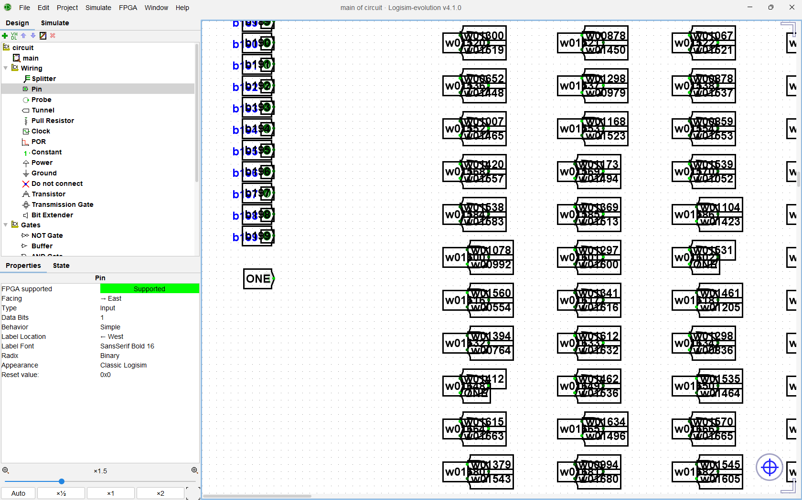
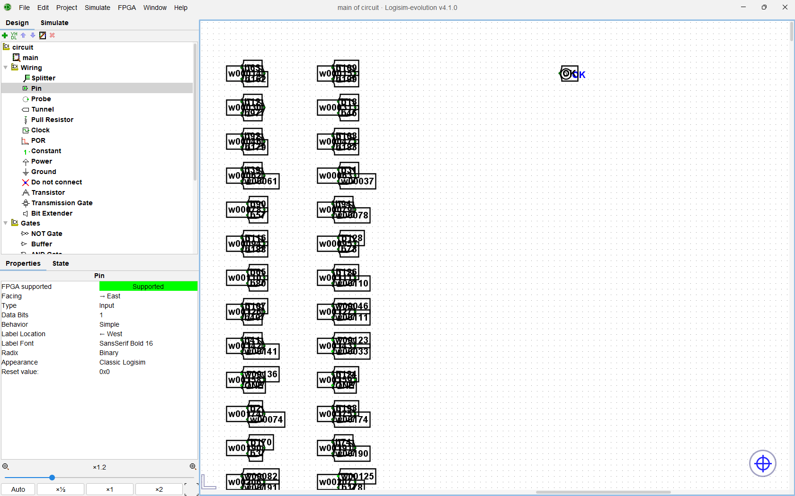
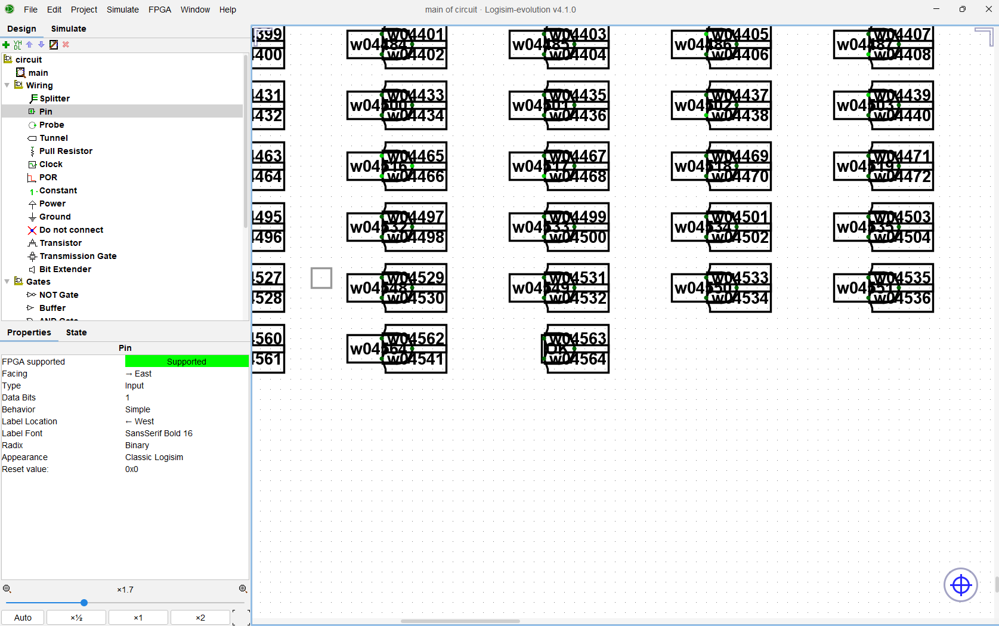
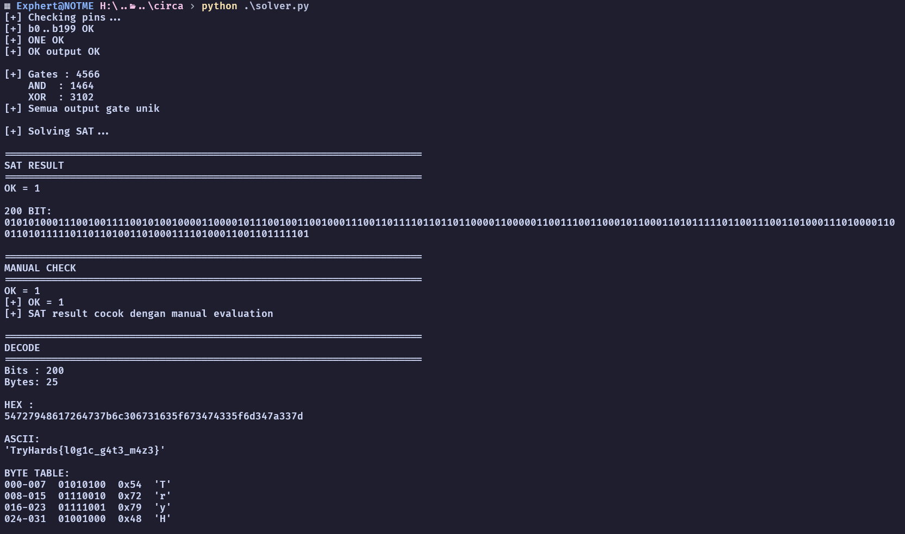

CTF: TryHards - Circa

Oke, disini ku jelasin gimana caranya.
jadi pertama itu download dulu file challnya. Di dalem file tersebut terdapat 2 file:
 - circuit.circ
 - note.txt

di note.txt ada url ke sebuah tools di github dan cluenya.
```
Try to use https://github.com/logisim-evolution/logisim-evolution/releases/latest
Get that OK to 1!
```

Setelah dibuka file `circuit.circ` di Logisim-evolution, disitu bisa diliat ada:
- 200 pin input (`b0` – `b199`) & 1 konstanta `ONE`


- 1 pin output `OK`


- Sekitar 4500+ gate AND & XOR yang terhubung lewat tunnel


Nah, karena ini simpelnya itu cuman nyari kombinasi benar/salah yang memenuhi syarat tertentu, yang tujuannya cuman satu. Ngatur tombol-tombol tadi biar diujung pin OK jadi 1.

Karena disini udah dapet apa aja yang harus di solve. Langsung saja saya lempar ke cetjipiti biar cepet.

https://chatgpt.com/share/6a957783-f620-83ec-a913-4d49e1b719d4

Setelah dapet file solvernya, saatnya ditest, dan didapatkan output flagnya.


